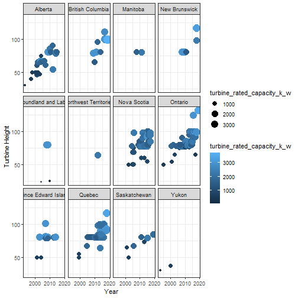

# Section 1: 
####  TidyTuesday and Shiny App

The TidyTuesday selection was written by a submitter named Hunter Kempf. 
His analysis visualized Canadian Wind turbine data from 1993 - 2019 by height, by year, household consumption, and turbine production. The plots are useful for those subsets of data but are limited in the ability to make deeper connections or draw meaningful conclusions from among the plots. 

As a result, the task was to provide a useful experience by implementing a **Shiny App** in ways that will allow the user to explore the visualizations. The platform populates interactive tables and graphs with reactive features. Across the platform, some emphasis is placed on demonstrating the evolution of production over time while providing broad views and access to the data.

In this way, reactive variables in a Shiny App create an interactive environment that is much improved from static plots. **Below are two original plots from the TidyTuesday selection that served as a starting point for developing our platform**. Reactive versions of each of these are found in the deployed app.

The final project, Canadian Wind Turbine Shiny App, is published here: https://jwolf15.shinyapps.io/final_project/,
and a version published without the final report is here: https://learningai.shinyapps.io/final_project/.


```
## `geom_smooth()` using method = 'gam' and formula 'y ~ s(x, bs = "cs")'
```


# Section 2: 
####  Data Preparation

The original code written by Kemp was kept intact throughout the project with the focus placed on enhancing the usefulness of the graphs. Within the original code, the turbine commissioning date was changed to the four-digit year as `year`, and the data frame created for `projects` takes on the mean by project name for each of the following variables: coordinates, project capacity, and the newly create `year` variable.

To enhance the plots, additional shapefiles were researched and added to create a new visualization of the Canadian map. The shapefiles bring in the additional geospatial vector data needed to draw boundaries for each of the provinces. 

The source for the shapefiles can be found at the website: https://www.weather.gov/gis/CanadianProvinces

Lastly, new visualizations were created by filtering, summarizing, grouping, or enumerating different variables. The new plots are further enhanced in the Shiny App with interactivity through reactive variables. New plots and corresponding code are shown below to demonstrate different ways the data was prepared and visualized.


```r
province <- st_read("./data/province/province.shp")
```

```
## Reading layer `province' from data source `C:\Users\jenni\Documents\DSBA\5122_Visual Analytics\Final Project\data\province\province.shp' using driver `ESRI Shapefile'
## Simple feature collection with 15 features and 2 fields
## geometry type:  MULTIPOLYGON
## dimension:      XY
## bbox:           xmin: -141 ymin: 41.68793 xmax: -52.63629 ymax: 83.11063
## geographic CRS: NAD83
```

```r
province %>% 
      ggplot() +
      geom_sf(aes(fill = NAME)) + 
      geom_sf_text(aes(label=NAME),size =1.5) + 
      geom_point(data = projects, aes(x = longitude, y = latitude, size = capacity))+
      theme_minimal()
```


```r
ggplot(wind_turbine, aes(year,hub_height_m)) + 
      geom_point(aes(size=turbine_rated_capacity_k_w,color=turbine_rated_capacity_k_w)) +
      theme_bw() +
      facet_wrap(~province_territory) +
      ylab('Turbine Height') +
      xlab('Year')
```



```r
 wind_turbine %>% 
        count(province_territory) %>% 
        ggplot(aes(forcats::fct_reorder(province_territory, n), n)) +
        geom_bar(stat="identity", fill="steelblue") +
        ggtitle("Number of Turbines for Each Province") +
        coord_flip() +
        theme_minimal() +
        ylab('Number of Turbines') +
        xlab('Province')
```


# Section 3: 
####  Effective Design

Much attention was paid to creating an effective and well-functioning design for the platform. Foremost, electing to build a Shiny App platform was the first design decision. Furthermore, the wind turbine data was explored in new visualizations, and the layout and organization of the Shiny App makes navigation and flow more intuitive as the various plots are viewed. Lastly, the reactivity in the plots easily replace the need to show multiple plots, particularly for a time series from various points in time.

However, the effectiveness of the design would benefit from new improvements. For example, the early phases of data exploration and analysis could incorporate different variables from the dataset, such as turbine manufacturer or rotor speed. A deeper analysis could lead to deciding on a more specific task, or set of tasks, for a more focused design.

# Section 4:
####  Holistic Design

A holistic design was the next priority after building a functioning and effective platform. The plots work as intended and populate as expected. In one plot, an if-else statement is used with a reactive variable that allows a user to select which bar graph to view. This feature renders the bar graphs about as quickly as the radial dial is selected. In addition, an interactive and animated plot displays data from each of the provinces, and it progresses smoothy as it renders dynamically from the reactive variables. 

Visual themes and aesthetics also aim to give the platform a holistic feel. The app's function and design were both part of creating a good user experience and influenced various design decisions. 

However, the plots rending the maps populate less quickly on the deployed app. The shapefiles populating the map may be reading more geospatial vector data than needed for these purposes. Rendering maps would be an area to explore and refine so the user can have the best experience as intended.

# Section 5:
####  User Evaluation

Performance and evaluation are important steps in systems development and in all phases of deployment. Beyond implementation, assessing the performance of the app against the needs of the users will provide valuable feedback to build new features and optimize usability.

As the Shiny App is deployed, a primary method of user evaluation would be to track the hours of usage and adoption rates. If these rates are low, Tamara Munzner recommends interviewing the users and target users to identify if the correct problem was addressed. Validation could also be performed by informal usability studies to determine whether the qualitative and quantitative analysis and images serve a useful purpose. The informal study could also help inform whether the maps are functioning at acceptable speeds, as previously addressed herein. 

# Section 6:
####  Future Improvements

The final phase of systems development brings the process back to the beginning with an analysis of the user feedback and making decisions for improving the platform. Any feedback received from informal studies and adoption rates would be reviewed and analyzed to inform the next iteration of design. 

Additionally, specific areas of improvement were noted in the report to address:

-- *Effective design*, and

-- *Holistic design*

#### Design Effectiveness
Future improvements would focus on data abstraction, operations, and possibly expanding the dataset by introducing new variables. Additional features and improvements would allow the user to explore the relationships between the different variables. Furthermore, the data analysis could include some data modeling that would be used to generate new plots and visualizations. 

The Shiny App currently includes an interactive data table where users can select and deselect which columns to view. One improvement would be to allow this selection to be visualized in different plots, possibly again chosen by the user. 

The various ways in which the data is analyzed and explored may largely depend on the results of the user feedback study. It is possible a specific task or set of tasks will emerge as new requirements, and the app would need to be adapted to continue enhancing its usefulness.

#### Holistic Design  
Furthermore, as future design improvements are integrated into the app, the performance, speed, and functionality will need to remain intact as well. Rendering maps is one area that can be improved, and as the analysis grows in complexity and more dynamic features are included, it becomes more important to approach the design decisions from a holistic perspective. Correct functionality, optimized performance, and efficient code will be aspects of the design to keep in high regard to make the user experience as positive as possible.

# Appendix
## List of Links

#### The deployed app, report, and full package can be found at the following links:

- Shiny App: https://jwolf15.shinyapps.io/final_project/

- Report on bookdown: https://bookdown.org/jenniwolf/barthe-deo-richard-wolf_finalreport/

- Project files on GitHub: https://github.com/zenheaven/shinyproj

Jennifer Wolf is the author, Team Lead,  Lead Developer for this content, to include the Shiny App, full report, project presentation.
Class of 2020, School of Data Science, University of North Carolina - Charlotte, Graduate Certificate program. 
This is the author's first Shiny App.


